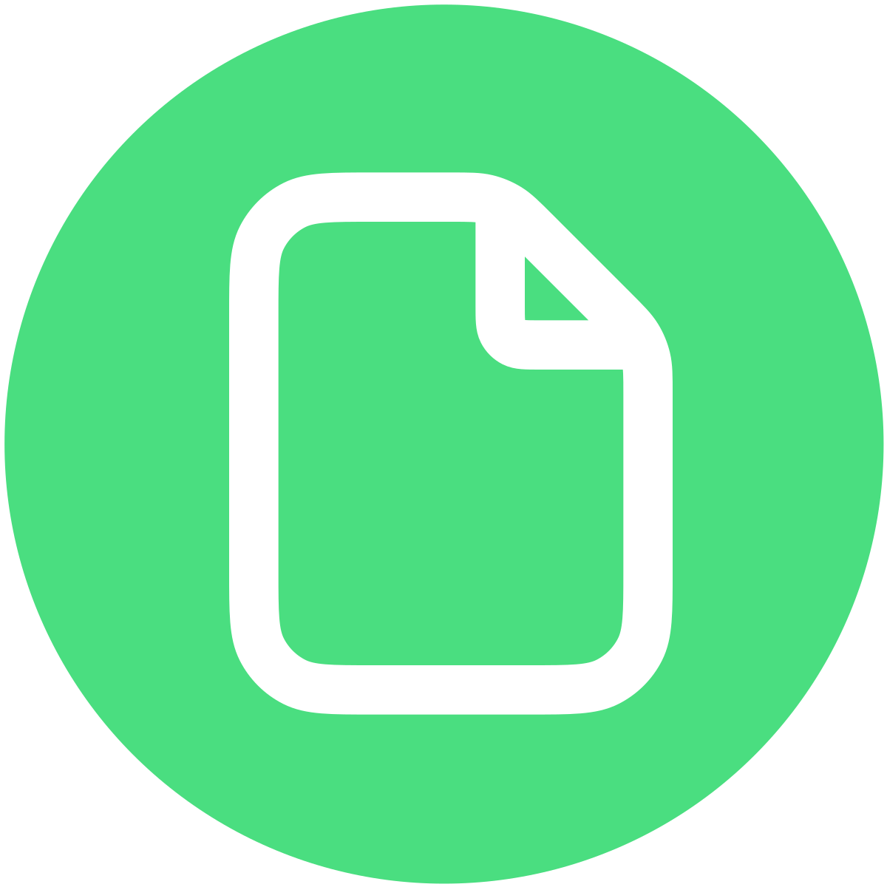

<div align="center" width="100%">
    
</div>

# PdfDing
PdfDing is a selfhosted PDF manager, viewer and editor offering a seamless user experience on multiple devices.

[](https://github.com/mrmn2/PdfDing)
[](https://hub.docker.com/r/mrmn/pdfding)
[](https://github.com/mrmn2/PdfDing/releases)
[](https://github.com/mrmn2/PdfDing/actions)
[](https://github.com/mrmn2/PdfDing/commits/master/)


## Introduction
PdfDing is a PDF manager, viewer and editor that you can host yourself. It offers a seamless user experience on multiple
devices. It's designed be to be minimal, fast, and easy to set up using Docker.

The name is a combination of PDF and *ding*. Ding is the German word for thing. Thus, PdfDing is a thing for
your PDFs. Initially inspired by [linkding](https://github.com/sissbruecker/linkding).

## Live Demo
Try PdfDing on the demo instance: https://demo.pdfding.com

This is a temporary live demo with shared user accounts, all data will be deleted every 60 minutes.

## Features
* Seamless browser based PDF viewing on multiple devices. Remembers current position - continue where you stopped reading
* Stay on top of your PDF collection with multi-level tagging, starring and archiving functionalities
* Edit PDFs by adding comments, highlighting and drawings
* Manage and export PDF highlights and comments in dedicated sections
* Clean, intuitive UI with dark mode, inverted color mode, custom theme colors and multiple layouts
* SSO support via OIDC
* Share PDFs with an external audience via a link or a QR Code with optional access control
* Markdown Notes
* Progress bars show the reading progress of each PDF at a quick glance

## Getting started
### Using Docker
To install PdfDing using Docker you can just run the image from [Docker Hub](https://hub.docker.com/r/mrmn/pdfding):

```
docker run --name pdfding \
    -p 8000:8000 \
    -v sqlite_data:/home/nonroot/pdfding/db -v media:/home/nonroot/pdfding/media \
    -e HOST_NAME=127.0.0.1 -e SECRET_KEY=some_secret -e CSRF_COOKIE_SECURE=FALSE -e SESSION_COOKIE_SECURE=FALSE \
    -d \
    mrmn/pdfding:latest
```

If everything completed successfully, the application should now be running
and can be accessed at http://127.0.0.1:8000.

If you use selinux it might be necessary to add the `:Z` after the volumes, e.g.
`sqlite_data:/home/nonroot/pdfding/db:Z`.

### Using Docker Compose
To install PdfDing using Docker Compose, you can use one of the files in the
[compose](https://github.com/mrmn2/PdfDing/tree/master/compose) directory and run e.g.:

```
docker-compose -d -f compose/sqlite.docker-compose.yaml
```

### Using Helm
PdfDing can be deployed on Kubernetes using the provided [helm chart](https://github.com/mrmn2/PdfDing/tree/master/helm-charts/pdfding).
To add the PdfDing helm repository, run:
```bash
helm repo add pdfding https://charts.pdfding.com
```
To install the PdfDing helm chart with a release name `my-release` in `ns` namespace, run:
```bash
helm install -n ns --create-namespace my-release pdfding/pdfding
```

## Guides
Guides about various aspects of PdfDing can be found in the
[guides](https://github.com/mrmn2/PdfDing/blob/master/docs/guides.md) section of the docs.

## Sponsor
I hope you enjoy using PdfDing as much as I enjoy developing it. If you want to give back,
you can support me on various platforms. This allows me to spend more time on improving PdfDing. Thanks!

<a href="https://github.com/sponsors/mrmn2" target="_blank">
  
</a>
<a href="https://www.buymeacoffee.com/mrmn2" target="_blank">
  
</a>
<a href="https://ko-fi.com/mrmn2" target="_blank">
  
</a>

## Configuration
Information about the different configuration options can be found in the
[configuration](https://github.com/mrmn2/PdfDing/blob/master/docs/configuration.md) section of the docs.

## Contributing
Small improvements, bugfixes and documentation improvements are always welcome.
If you want to contribute a larger feature, consider opening an issue first to
discuss it. I may choose to ignore PRs for features that don't align with the
project's goals or that I don't want to maintain.

If you are interested in contributing more information can be found in the
[development](https://github.com/mrmn2/PdfDing/blob/master/docs/development.md) section of the docs.

## Comparison with Stirling PDF
While [Stirling PDF](https://github.com/Stirling-Tools/Stirling-PDF) and PdfDing are both self-hosted web
applications centered around PDF files, they still differ in their use case. Stirling PDF focuses on
performing various operations like splitting, cropping and rotating on your PDFs. PdfDing however has a
different focus, it is all about reading and organizing your PDFs. All features are added with the goal of
improving the reading experience or making the management of your PDF collection simpler. PdfDing's editing
functionalities were added with the same idea in mind. You can add annotations, highlighting and drawings to
PDFs, so that you can highlight or add information that will be beneficial to your reading experience.
